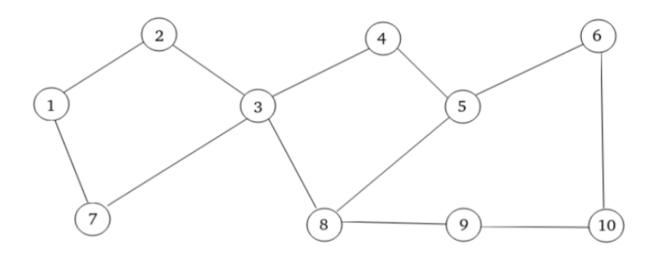

# Wireless_Environment_Election
Implementation of a leader election algorithm for wireless ad hoc networks, discussed in Tanenbaum’s Distributed Systems.

## 🛜 Topology



## 🚀 How to run

First, access the processes directory:

```bash
cd processes/
```

Then, use the command to simultaneously run the 10 processes:
```bash
for i in {1..10}; do
    gnome-terminal --title="Process $i" --command="bash -c 'python3 process$i.py --id $i; exec bash'" &
    sleep 0.1
done
```
